## iAyos: Work Breakdown Structure (WBS)

Below is a WBS rendered as a Mermaid diagram (column layout by phase), followed by a simple text outline for quick reference.

```mermaid
flowchart LR
  %% iAyos Work Breakdown Structure (WBS)
  classDef phase fill:#f8f8f8,stroke:#333,stroke-width:1px,color:#111;
  classDef task fill:#ffffff,stroke:#777,stroke-width:1px,color:#111;

  subgraph P1[Phase 1 – Planning]
    class P1 phase
    P1_1["1.1 Create a company"]
    P1_2["1.2 Design a company logo"]
    P1_3["1.3 Define company mission, vision, and goals"]
    P1_4["1.4 Define company organizational structure"]
    P1_5["1.5 Define company policies and penalties"]
    P1_6["1.6 Establish and promote company"]
    P1_7["1.7 Close a deal with a client"]
    P1_8["1.8 Create project action plan"]
    P1_9["1.9 Determine project milestones and deliverables"]
    P1_10["1.10 Create work breakdown structure"]
    P1_11["1.11 Create an online project board"]
    P1_12["1.12 Create an online Gantt Chart"]
    P1_13["1.13 Create Activity Network Diagram"]
    P1_14["1.14 Determine project critical path and slack time"]
    P1_15["1.15 Collate project documentation for Phase 1"]
    class P1_1,P1_2,P1_3,P1_4,P1_5,P1_6,P1_7,P1_8,P1_9,P1_10,P1_11,P1_12,P1_13,P1_14,P1_15 task
  end

  subgraph P2[Phase 2 – Analysis]
    class P2 phase
    P2_1["2.1 Identify data collection method"]
    P2_2["2.2 Conduct initial data gathering"]
    P2_3["2.3 Transcribe and analyze collected data"]
    P2_4["2.4 Propose initial solution for the project"]
    P2_5["2.5 Determine project cost"]
    P2_6["2.6 Conduct feasibility study"]
    P2_7["2.7 List initial project requirements"]
    P2_8["2.8 Determine hardware requirements"]
    P2_9["2.9 Determine software requirements"]
    P2_10["2.10 Determine network requirements"]
    P2_11["2.11 Determine database requirements"]
    P2_12["2.12 Identify software specifications"]
    P2_13["2.13 List product features"]
    P2_14["2.14 List product attributes"]
    P2_15["2.15 Create product mockups"]
    P2_16["2.16 Initial ERD"]
    P2_17["2.17 Finalize documentation for Phase II"]
    class P2_1,P2_2,P2_3,P2_4,P2_5,P2_6,P2_7,P2_8,P2_9,P2_10,P2_11,P2_12,P2_13,P2_14,P2_15,P2_16,P2_17 task
  end

  subgraph P3[Phase 3 – Design]
    class P3 phase
    P3_1["3.1 Determine system architecture"]
    P3_2["3.2 Create business use case"]
    P3_3["3.3 Create context and data flow diagram"]
    P3_4["3.4 Design system models"]
    P3_5["3.5 Design user interface"]
    P3_6["3.6 Create product prototype"]
    P3_7["3.7 Database Structure Engineering"]
    P3_8["3.8 Finalize documentation for Phase III"]
    class P3_1,P3_2,P3_3,P3_4,P3_5,P3_6,P3_7,P3_8 task
  end

  subgraph P4[Phase 4 – Coding]
    class P4 phase
    P4_1["4.1 Write System Module 1 – Onboarding"]
    P4_2["4.2 Write System Module 2 – Authentication"]
    P4_3["4.3 Get feedback from a consultant 1"]
    P4_4["4.4 Debug, fix bugs, and update modules"]
    P4_5["4.5 Write System Module 3 – Homepage"]
    P4_6["4.6 Write System Module 4 – User Profiles"]
    P4_7["4.7 Write System Module 5 – AI Support"]
    P4_8["4.8 Integrate System Modules"]
    P4_9["4.9 Get feedback from a consultant 2"]
    P4_10["4.10 Debug, fix bugs, and update modules"]
    P4_11["4.11 Conduct unit testing"]
    P4_12["4.12 Finalize product design and coding"]
    class P4_1,P4_2,P4_3,P4_4,P4_5,P4_6,P4_7,P4_8,P4_9,P4_10,P4_11,P4_12 task
  end

  subgraph P5[Phase 5 – Testing]
    class P5 phase
    P5_1["5.1 Create testing plan"]
    P5_2["5.2 Create test cases"]
    P5_3["5.3 Conduct alpha testing"]
    P5_4["5.4 Conduct beta testing"]
    P5_5["5.5 Fix system errors"]
    P5_6["5.6 Conduct software/product attributes testing"]
    P5_7["5.7 Conduct performance and load testing per increment"]
    P5_8["5.8 Conduct user acceptance testing"]
    P5_9["5.9 Create migration plan"]
    P5_10["5.10 Deploy system/product to client’s site"]
    class P5_1,P5_2,P5_3,P5_4,P5_5,P5_6,P5_7,P5_8,P5_9,P5_10 task
  end

  subgraph P6[Phase 6 – Maintenance]
    class P6 phase
    P6_1["6.1 Create product manual"]
    P6_2["6.2 Gather and analyze customer feedback"]
    P6_3["6.3 Perform corrective maintenance"]
    P6_4["6.4 Perform perfective maintenance"]
    P6_5["6.5 Perform adaptive maintenance"]
    P6_6["6.6 Finalize project documentation"]
    P6_7["6.7 Turn-over project to client and close the project"]
    class P6_1,P6_2,P6_3,P6_4,P6_5,P6_6,P6_7 task
  end
```

### Text outline (fallback)

- **Phase 1 – Planning**
  - 1.1 Create a company
  - 1.2 Design a company logo
  - 1.3 Define company mission, vision, and goals
  - 1.4 Define company organizational structure
  - 1.5 Define company policies and penalties
  - 1.6 Establish and promote company
  - 1.7 Close a deal with a client
  - 1.8 Create project action plan
  - 1.9 Determine project milestones and deliverables
  - 1.10 Create work breakdown structure
  - 1.11 Create an online project board
  - 1.12 Create an online Gantt Chart
  - 1.13 Create Activity Network Diagram
  - 1.14 Determine project critical path and slack time
  - 1.15 Collate project documentation for Phase 1

- **Phase 2 – Analysis**
  - 2.1 Identify data collection method
  - 2.2 Conduct initial data gathering
  - 2.3 Transcribe and analyze collected data
  - 2.4 Propose initial solution for the project
  - 2.5 Determine project cost
  - 2.6 Conduct feasibility study
  - 2.7 List initial project requirements
  - 2.8 Determine hardware requirements
  - 2.9 Determine software requirements
  - 2.10 Determine network requirements
  - 2.11 Determine database requirements
  - 2.12 Identify software specifications
  - 2.13 List product features
  - 2.14 List product attributes
  - 2.15 Create product mockups
  - 2.16 Initial ERD
  - 2.17 Finalize documentation for Phase II

- **Phase 3 – Design**
  - 3.1 Determine system architecture
  - 3.2 Create business use case
  - 3.3 Create context and data flow diagram
  - 3.4 Design system models
  - 3.5 Design user interface
  - 3.6 Create product prototype
  - 3.7 Database Structure Engineering
  - 3.8 Finalize documentation for Phase III

- **Phase 4 – Coding**
  - 4.1 Write System Module 1 – Onboarding
  - 4.2 Write System Module 2 – Authentication
  - 4.3 Get feedback from a consultant 1
  - 4.4 Debug, fix bugs, and update modules
  - 4.5 Write System Module 3 – Homepage
  - 4.6 Write System Module 4 – User Profiles
  - 4.7 Write System Module 5 – AI Support
  - 4.8 Integrate System Modules
  - 4.9 Get feedback from a consultant 2
  - 4.10 Debug, fix bugs, and update modules
  - 4.11 Conduct unit testing
  - 4.12 Finalize product design and coding

- **Phase 5 – Testing**
  - 5.1 Create testing plan
  - 5.2 Create test cases
  - 5.3 Conduct alpha testing
  - 5.4 Conduct beta testing
  - 5.5 Fix system errors
  - 5.6 Conduct software/product attributes testing
  - 5.7 Conduct performance and load testing per increment
  - 5.8 Conduct user acceptance testing
  - 5.9 Create migration plan
  - 5.10 Deploy system/product to client’s site

- **Phase 6 – Maintenance**
  - 6.1 Create product manual
  - 6.2 Gather and analyze customer feedback
  - 6.3 Perform corrective maintenance
  - 6.4 Perform perfective maintenance
  - 6.5 Perform adaptive maintenance
  - 6.6 Finalize project documentation
  - 6.7 Turn-over project to client and close the project

Tips: View this diagram directly in tools that support Mermaid (e.g., GitHub, VS Code with Mermaid extension). A standalone Mermaid file is also saved as `wbs.mmd`.
